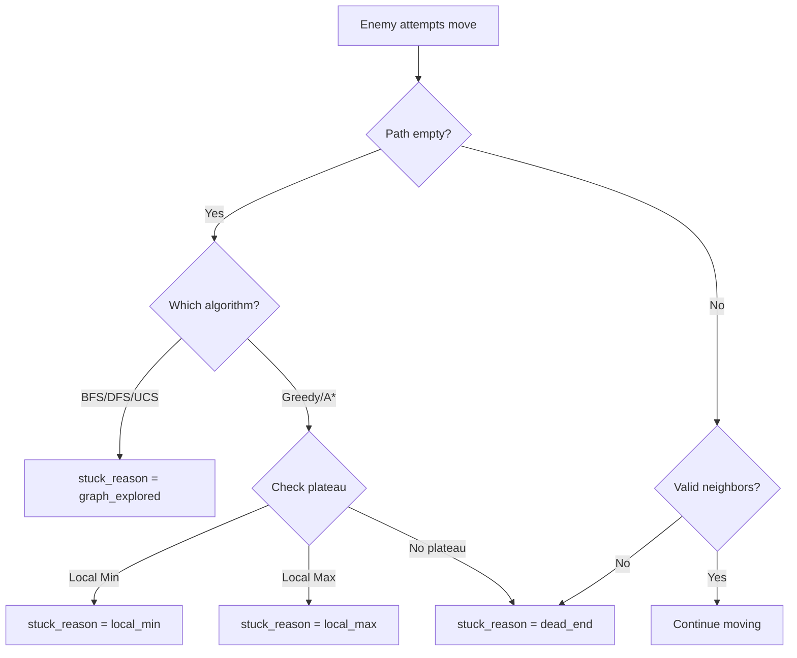

# Algorithm Arena - Implementation Details

## Overview
This document provides comprehensive technical details of all systems and algorithms implemented in the final version of Algorithm Arena.

---

## Table of Contents
1. [Algorithm-Specific Behaviors](#algorithm-specific-behaviors)
2. [Game Balance System](#game-balance-system)
3. [Victory Condition System](#victory-condition-system)
4. [Player Tracking System](#player-tracking-system)
5. [Tooltip System](#tooltip-system)
6. [Animation System](#animation-system)
7. [Graph System](#graph-system)
8. [Combat System](#combat-system)
9. [State Management](#state-management)

---

## Algorithm-Specific Behaviors

### BFS (Breadth-First Search)

#### Implementation Location
`algorithms/graph_algorithms.py` - `bfs_find_path()`

#### Core Algorithm
```python
def bfs_find_path(graph, start_node, goal_node, visited_leaves, visited_nodes):
    frontier = deque([start_node])  # FIFO queue
    start_node.visited = True
    
    while frontier:
        current = frontier.popleft()
        visited_nodes.add(current)
        
        if current.is_leaf():
            visited_leaves.add(current)
        
        if current == goal_node:
            return reconstruct_path(current)
        
        for neighbor in current.neighbors:
            if not neighbor.is_leaf() or neighbor not in visited_leaves:
                if not neighbor.visited:
                    neighbor.visited = True
                    neighbor.parent = current
                    frontier.append(neighbor)
```

#### Backtracking Rules
- **Parent Backtracking Allowed**: Enemy can return to previously visited parent nodes
- **Leaf Node Restriction**: Once a leaf node is visited, it's added to `visited_leaves` and cannot be revisited
- **Implementation**: `visited_leaves` set persists across all path recalculations

#### Win Condition Logic
```python
# In core/gameplay.py - EnemyAI.get_next_move()
if not self.path:
    # BFS/DFS/UCS: Graph exploration complete
    self.stuck = True
    self.stuck_reason = "graph_explored"
```

#### Visited Node Tracking
- Nodes added to `visited_nodes` set when expanded
- Tooltip immediately shows "Visited: Yes" after expansion
- Set persists across recalculations for accurate tracking

---

### DFS (Depth-First Search)

#### Implementation Location
`algorithms/graph_algorithms.py` - `dfs_find_path()`

#### Core Algorithm
```python
def dfs_find_path(graph, start_node, goal_node, visited_leaves, visited_nodes):
    frontier = [start_node]  # LIFO stack
    start_node.visited = True
    
    while frontier:
        current = frontier.pop()  # Pop from end (LIFO)
        visited_nodes.add(current)
        
        if current.is_leaf():
            visited_leaves.add(current)
        
        if current == goal_node:
            return reconstruct_path(current)
        
        for neighbor in current.neighbors:
            if not neighbor.is_leaf() or neighbor not in visited_leaves:
                if not neighbor.visited:
                    neighbor.visited = True
                    neighbor.parent = current
                    frontier.append(neighbor)
```

#### Differences from BFS
- Uses stack (LIFO) instead of queue (FIFO)
- Explores depth-first instead of level-by-level
- May find longer paths than BFS

#### Backtracking and Win Conditions
- Same as BFS: parent backtracking allowed, leaf nodes restricted
- Same victory condition: graph exploration complete

---

### UCS (Uniform Cost Search)

#### Implementation Location
`algorithms/graph_algorithms.py` - `ucs_find_path()`

#### Core Algorithm
```python
def ucs_find_path(graph, start_node, goal_node, visited_leaves, visited_nodes):
    frontier = [(0, id(start_node), start_node)]  # Priority queue
    start_node.g_cost = 0
    start_node.visited = True
    
    while frontier:
        cost, _, current = heapq.heappop(frontier)
        visited_nodes.add(current)
        
        if current.is_leaf():
            visited_leaves.add(current)
        
        if current == goal_node:
            return reconstruct_path(current)
        
        for neighbor, weight in current.neighbors:
            new_cost = current.g_cost + weight
            
            if not neighbor.is_leaf() or neighbor not in visited_leaves:
                if not neighbor.visited or new_cost < neighbor.g_cost:
                    neighbor.visited = True
                    neighbor.g_cost = new_cost
                    neighbor.parent = current
                    heapq.heappush(frontier, (new_cost, id(neighbor), neighbor))
```

#### Key Features
- Uses priority queue ordered by path cost
- Can revisit nodes with lower cost (except leaf nodes)
- Finds lowest-cost path to goal

#### Backtracking and Win Conditions
- Same as BFS/DFS for leaf nodes
- Can revisit non-leaf nodes if lower cost found
- Same victory condition: graph exploration complete

---

### Greedy (Local Min)

#### Implementation Location
`algorithms/graph_algorithms.py` - `greedy_local_min_find_path()`

#### Core Algorithm
```python
def greedy_local_min_find_path(graph, start_node, goal_node, visited_nodes):
    start_node.h_cost = start_node.get_heuristic_to(goal_node)
    frontier = [(start_node.h_cost, id(start_node), start_node)]
    start_node.visited = True
    
    while frontier:
        _, _, current = heapq.heappop(frontier)
        visited_nodes.add(current)  # CRITICAL: No backtracking
        
        if current == goal_node:
            return reconstruct_path(current)
        
        for neighbor, weight in current.neighbors:
            if neighbor in visited_nodes:  # STRICT: Skip visited
                continue
            
            if not neighbor.visited:
                neighbor.visited = True
                neighbor.parent = current
                neighbor.h_cost = neighbor.get_heuristic_to(goal_node)
                heapq.heappush(frontier, (neighbor.h_cost, id(neighbor), neighbor))
```

#### Plateau Detection Logic
```python
# In core/gameplay.py - EnemyAI.get_next_move()
if 'Greedy (Local Min)' in self.algorithm:
    current_h = self.node.get_heuristic_to(self.player_node)
    all_greater = all(
        neighbor.get_heuristic_to(self.player_node) > current_h
        for neighbor, _ in valid_neighbors
    )
    if all_greater:
        self.stuck = True
        self.stuck_reason = "local_min"
```

#### No Backtracking Implementation
- `visited_nodes` set tracks ALL nodes ever visited
- Before expanding a neighbor, checks `if neighbor in visited_nodes: continue`
- Once visited, node is permanently excluded from future searches

#### Player Tracking System
```python
# Enemy only follows if player moves to lower heuristic neighbor
player_moved_to_min = False
for neighbor, _ in player_node.neighbors:
    if neighbor == new_player_pos:
        if neighbor.h_cost < player_node.h_cost:
            player_moved_to_min = True
            break

if player_moved_to_min:
    recalculate_path()  # Follow player
else:
    # Player didn't move toward minimum, enemy stops tracking
    pass
```

---

### Greedy (Local Max)

#### Implementation Location
`algorithms/graph_algorithms.py` - `greedy_local_max_find_path()`

#### Core Algorithm
```python
def greedy_local_max_find_path(graph, start_node, goal_node, visited_nodes):
    start_node.h_cost = start_node.get_heuristic_to(goal_node)
    # Use NEGATIVE heuristic for max-heap behavior
    frontier = [(-start_node.h_cost, id(start_node), start_node)]
    start_node.visited = True
    
    while frontier:
        _, _, current = heapq.heappop(frontier)
        visited_nodes.add(current)
        
        if current == goal_node:
            return reconstruct_path(current)
        
        for neighbor, weight in current.neighbors:
            if neighbor in visited_nodes:
                continue
            
            if not neighbor.visited:
                neighbor.visited = True
                neighbor.parent = current
                neighbor.h_cost = neighbor.get_heuristic_to(goal_node)
                # Negate for max-heap
                heapq.heappush(frontier, (-neighbor.h_cost, id(neighbor), neighbor))
```

#### Plateau Detection Logic
```python
# In core/gameplay.py
if 'Greedy (Local Max)' in self.algorithm:
    current_h = self.node.get_heuristic_to(self.player_node)
    all_smaller = all(
        neighbor.get_heuristic_to(self.player_node) < current_h
        for neighbor, _ in valid_neighbors
    )
    if all_smaller:
        self.stuck = True
        self.stuck_reason = "local_max"
```

#### Key Difference from Local Min
- Seeks MAXIMUM heuristic values instead of minimum
- Uses negated heuristic for priority queue (max-heap behavior)
- Plateau detection checks if all neighbors are SMALLER

---

### A* (Local Min)

#### Implementation Location
`algorithms/graph_algorithms.py` - `astar_local_min_find_path()`

#### Core Algorithm
```python
def astar_local_min_find_path(graph, start_node, goal_node, visited_nodes):
    start_node.g_cost = 0
    start_node.h_cost = start_node.get_heuristic_to(goal_node)
    start_node.f_cost = start_node.g_cost + start_node.h_cost
    frontier = [(start_node.f_cost, id(start_node), start_node)]
    
    while frontier:
        _, _, current = heapq.heappop(frontier)
        visited_nodes.add(current)
        
        if current == goal_node:
            return reconstruct_path(current)
        
        for neighbor, weight in current.neighbors:
            if neighbor in visited_nodes:
                continue
            
            if not neighbor.visited:
                neighbor.visited = True
                neighbor.g_cost = current.g_cost + weight
                neighbor.h_cost = neighbor.get_heuristic_to(goal_node)
                neighbor.f_cost = neighbor.g_cost + neighbor.h_cost
                heapq.heappush(frontier, (neighbor.f_cost, id(neighbor), neighbor))
```

#### Plateau Detection Logic
```python
# In core/gameplay.py
if 'A* (Local Min)' in self.algorithm:
    current_f = self.node.g_cost + self.node.get_heuristic_to(self.player_node)
    all_greater_f = all(
        (neighbor.g_cost + neighbor.get_heuristic_to(self.player_node)) > current_f
        for neighbor, _ in valid_neighbors
    )
    if all_greater_f:
        self.stuck = True
        self.stuck_reason = "local_min"
```

#### Differences from Greedy Local Min
- Uses f(n) = g(n) + h(n) instead of just h(n)
- Considers path cost in addition to heuristic
- Plateau detection based on f-values instead of h-values

---

### A* (Local Max)

#### Implementation Location
`algorithms/graph_algorithms.py` - `astar_local_max_find_path()`

#### Core Algorithm
```python
def astar_local_max_find_path(graph, start_node, goal_node, visited_nodes):
    start_node.g_cost = 0
    start_node.h_cost = start_node.get_heuristic_to(goal_node)
    # Invert heuristic for maximization
    max_h = max(node.get_heuristic_to(goal_node) for node in graph.nodes)
    start_node.f_cost = start_node.g_cost + (max_h - start_node.h_cost)
    frontier = [(start_node.f_cost, id(start_node), start_node)]
    
    # Similar to Local Min but with inverted heuristic
    # ...
```

#### Inverted Heuristic
- Uses `f(n) = g(n) + (max_h - h(n))` to prefer higher h-values
- Makes algorithm seek maximum heuristic values
- Plateau detection checks for smaller f-values

---

## Game Balance System

### Initial Path Generation

#### Purpose
Ensure Greedy/A* algorithms have a valid path from enemy to player at game start, preventing immediate plateau victories.

#### Implementation Location
`core/graph.py` - `assign_balanced_costs()`

#### BFS Pathfinding
```python
def assign_balanced_costs(self, enemy_node, player_node, algorithm):
    # Find shortest path using BFS
    visited = set()
    parent_map = {enemy_node: None}
    queue = [enemy_node]
    visited.add(enemy_node)
    
    while queue:
        current = queue.pop(0)
        if current == player_node:
            break
        for neighbor, _ in current.neighbors:
            if neighbor not in visited:
                visited.add(neighbor)
                parent_map[neighbor] = current
                queue.append(neighbor)
    
    # Reconstruct path
    path_to_player = []
    node = player_node
    while node is not None:
        path_to_player.append(node)
        node = parent_map.get(node)
    path_to_player.reverse()
```

#### Gradient Assignment for Local Min
```python
if 'Local Min' in algorithm:
    if path_to_player and len(path_to_player) > 1:
        total_range = 300.0 - 20.0  # 280 units
        path_length = len(path_to_player)
        gap = total_range / max(1, path_length - 1)
        gap = min(gap, 50.0)  # Cap at 50
        
        # Assign DESCENDING values along path
        for i, node in enumerate(path_to_player):
            value = 300.0 - (i * gap)
            node.heuristic = max(20.0, value)
        
        # Other nodes get random values
        for node in self.nodes:
            if node not in path_to_player:
                node.heuristic = random.uniform(50.0, 350.0)
```

#### Gradient Assignment for Local Max
```python
if 'Local Max' in algorithm:
    if path_to_player and len(path_to_player) > 1:
        total_range = 300.0 - 20.0
        path_length = len(path_to_player)
        gap = total_range / max(1, path_length - 1)
        gap = min(gap, 50.0)
        
        # Assign ASCENDING values along path
        for i, node in enumerate(path_to_player):
            value = 20.0 + (i * gap)
            node.heuristic = min(300.0, value)
        
        # Other nodes get random values
        for node in self.nodes:
            if node not in path_to_player:
                node.heuristic = random.uniform(10.0, 300.0)
```

#### UCS Path Cost Assignment
```python
if algorithm == 'UCS':
    if path_to_player:
        # Lower costs along path
        for node in path_to_player:
            node.path_cost = random.uniform(10.0, 80.0)
        # Higher costs elsewhere
        for node in self.nodes:
            if node not in path_to_player:
                node.path_cost = random.uniform(100.0, 300.0)
```

### Value Ranges
- **Heuristics**: 20.0 to 300.0
- **Path nodes**: Guaranteed gradient with minimum gap
- **Non-path nodes**: Random within wider range

### Dynamic Gap Sizing
```python
gap = total_range / max(1, path_length - 1)
gap = min(gap, 50.0)  # Prevent too large gaps on short paths
```

---

## Victory Condition System

### Stuck Detection

#### Implementation Location
`core/gameplay.py` - `EnemyAI.get_next_move()`

#### Stuck Flags
```python
class EnemyAI:
    def __init__(self, ...):
        self.stuck = False
        self.stuck_reason = ""
```

#### Detection Logic Flow


#### Code Implementation
```python
def get_next_move(self):
    if self.stuck:
        return None
    
    if not self.path:
        # Path is empty - determine why
        if 'BFS' in self.algorithm or 'DFS' in self.algorithm or 'UCS' in self.algorithm:
            self.stuck = True
            self.stuck_reason = "graph_explored"
        else:
            # For Greedy/A*, check if stuck at plateau
            if no_unvisited_neighbors:
                self.stuck = True
                self.stuck_reason = "dead_end"
    
    # Plateau detection (Greedy/A* only)
    if 'Greedy (Local Min)' in self.algorithm or 'A* (Local Min)' in self.algorithm:
        if all neighbors have greater values:
            self.stuck = True
            self.stuck_reason = "local_min"
    
    # Similar for Local Max...
```

### Victory Message Generation

#### Implementation Location
`core/graphics.py` - `draw_victory_screen()`

#### Message Mapping
```python
def draw_victory_screen(self, player_stats, enemy_stats, game_time, victory_reason):
    if victory_reason == "local_min":
        subtitle = "Enemy reached local minimum but couldn't find player!"
    elif victory_reason == "local_max":
        subtitle = "Enemy reached local maximum but couldn't find player!"
    elif victory_reason == "graph_explored":
        subtitle = "Enemy explored entire graph but couldn't find player!"
    elif victory_reason == "dead_end":
        subtitle = "Enemy got stuck in a dead-end!"
    elif victory_reason == "combat":
        subtitle = f"You defeated the {self.algorithm} enemy!"
    else:
        subtitle = f"You outsmarted the {self.algorithm} algorithm!"
```

### Reason Propagation
```python
# In core/gameplay.py - GameSession.update()
if self.enemy.stuck and not self.is_victory:
    self.is_victory = True
    self.victory_reason = self.enemy.stuck_reason if self.enemy.stuck_reason else "enemy_stuck"

# Passed to victory screen
victory_reason = getattr(game_session, 'victory_reason', "")
renderer.draw_victory_screen(player_stats, enemy_stats, game_time, victory_reason)
```

---

## Player Tracking System

### Conditional Following Logic

#### Greedy (Local Min) Implementation
```python
# In core/gameplay.py - EnemyAI.recalculate_path()
if 'Greedy (Local Min)' in self.algorithm:
    player_moved_to_min = False
    
    # Check if player moved to a minimum-value neighbor
    for neighbor, _ in self.player_last_pos.neighbors:
        if neighbor == current_player_pos:
            if neighbor.get_heuristic_to(self.player_node) < self.player_last_pos.get_heuristic_to(self.player_node):
                player_moved_to_min = True
                break
    
    if player_moved_to_min:
        # Recalculate path to new player position
        path, stats = greedy_local_min_find_path(...)
    else:
        # Player didn't move toward minimum, maintain current path
        # This allows player to "escape" by moving away from gradient
        pass
```

#### Why Player Tracking Matters
- **Strategic Gameplay**: Player can escape by moving perpendicular to gradient
- **Educational Value**: Demonstrates how greedy algorithms can lose track
- **Balanced Difficulty**: Prevents enemy from being omniscient

---

## Tooltip System

### Implementation Location
`core/graphics.py` - `draw_tooltip()`

### Tooltip Content

#### Standard Information (All Algorithms)
```python
def draw_tooltip(self, node, mouse_pos):
    lines = [
        f"Node {node.label}",
        f"Neighbors: {len(node.neighbors)}"
    ]
    
    # Visited status - ALWAYS show current state
    if node in self.visited_nodes:
        lines.append("Visited: Yes")
    else:
        lines.append("Visited: No")
```

#### Greedy/A* Additional Information
```python
if 'Greedy' in self.algorithm or 'A*' in self.algorithm:
    lines.append(f"Heuristic: {node.heuristic:.1f}")
    
if 'A*' in self.algorithm:
    lines.append(f"Path Cost: {node.path_cost:.1f}")
```

### Real-Time Updates

#### Visited Status
```python
# In algorithms/graph_algorithms.py - All algorithms
while frontier:
    current = frontier.pop()
    visited_nodes.add(current)  # Immediately added
    # Tooltip will show "Visited: Yes" on next frame
```

#### Why Immediate Updates Matter
- Shows algorithm progression in real-time
- Educational: see which nodes are explored
- Helps player understand algorithm behavior

---

## Animation System

### Smooth Interpolation

#### Implementation Location
`core/gameplay.py` - `PlayerEntity.update()` and `EnemyAI.update()`

#### Easing Function
```python
def ease_in_out_cubic(t: float) -> float:
    """Smooth cubic easing function.
    
    Args:
        t: Progress from 0.0 to 1.0
        
    Returns:
        Eased value from 0.0 to 1.0
    """
    return t * t * (3 - 2 * t)
```

#### Animation Properties
```python
class PlayerEntity:
    def __init__(self, start_node):
        self.node = start_node  # Logical position
        self.visual_pos = start_node.pos  # Rendered position
        self.animating = False
        self.animation_start_time = 0
        self.animation_start_pos = start_node.pos
        self.animation_target_pos = start_node.pos
```

#### Update Logic
```python
def update(self, current_time, delta_time, algorithm):
    if self.animating:
        # Calculate animation progress
        elapsed = current_time - self.animation_start_time
        progress = min(1.0, elapsed / 400.0)  # 400ms duration
        
        # Apply easing
        eased = self.ease_in_out_cubic(progress)
        
        # Interpolate position
        start_x, start_y = self.animation_start_pos
        target_x, target_y = self.animation_target_pos
        
        self.visual_pos = (
            start_x + (target_x - start_x) * eased,
            start_y + (target_y - start_y) * eased
        )
        
        # Check if complete
        if progress >= 1.0:
            self.animating = False
            self.visual_pos = self.animation_target_pos
```

#### Rendering
```python
# In core/graphics.py
def draw_player(self, player):
    # Use visual_pos instead of node.pos
    x, y = player.visual_pos
    pygame.draw.circle(self.screen, color, (int(x), int(y)), radius)
```

### Queue System Animation

#### Visualization
```python
def draw_queued_path(self, player):
    if not player.move_queue:
        return
    
    # Draw dashed lines between queued nodes
    for i in range(len(player.move_queue)):
        start_pos = player.node.pos if i == 0 else player.move_queue[i-1].pos
        end_pos = player.move_queue[i].pos
        self.draw_dashed_line(start_pos, end_pos, color=(0, 255, 255))
    
    # Draw numbers on queued nodes
    for i, node in enumerate(player.move_queue):
        number = self.small_font.render(str(i+1), True, (0, 255, 255))
        self.screen.blit(number, (node.pos[0], node.pos[1] - 30))
```

---

## Graph System

### Node Generation

#### Implementation Location
`core/graph.py` - `Graph.__init__()`

#### Organic Layout Algorithm
```python
def _generate_nodes(self):
    # Distribute nodes in organic pattern
    for i in range(self.num_nodes):
        angle = (i / self.num_nodes) * 2 * math.pi
        radius = random.uniform(200, min(width, height) / 2 - 50)
        
        x = center_x + radius * math.cos(angle) + random.uniform(-30, 30)
        y = center_y + radius * math.sin(angle) + random.uniform(-30, 30)
        
        node = Node(f"N{i+1}", (x, y))
        self.nodes.append(node)
```

### Connectivity

#### Connection Algorithm
```python
def _connect_nodes(self):
    for node in self.nodes:
        # Find nearest neighbors
        distances = []
        for other in self.nodes:
            if other != node:
                dist = node.distance_to(other)
                distances.append((dist, other))
        
        distances.sort(key=lambda x: x[0])
        
        # Connect to 3-6 nearest neighbors
        num_connections = random.randint(3, 6)
        for i in range(min(num_connections, len(distances))):
            _, neighbor = distances[i]
            weight = random.uniform(1.0, 10.0)
            node.add_neighbor(neighbor, weight)
            neighbor.add_neighbor(node, weight)  # Bidirectional
```

#### Leaf Node Control
```python
# Ensure 8-12 leaf nodes for full game
target_leaves = random.randint(8, 12)
current_leaves = sum(1 for node in self.nodes if node.is_leaf())

if current_leaves < target_leaves:
    # Remove connections from nodes with many neighbors
    pass
elif current_leaves > target_leaves:
    # Add connections to leaf nodes
    pass
```

---

## Combat System

### Damage Mechanics

#### Implementation Location
`core/combat.py` - `CombatSystem`

#### Contact Detection
```python
def check_contact(self, player_node, enemy_node, current_time):
    if player_node == enemy_node:
        # Same node - apply damage if cooldown expired
        if current_time - self.last_damage_time >= DAMAGE_COOLDOWN:
            self.player.hp -= CONTACT_DAMAGE
            self.enemy.hp -= CONTACT_DAMAGE
            self.last_damage_time = current_time
```

#### Game Over Conditions
```python
def is_game_over(self):
    if self.player.hp <= 0:
        return True, 'defeat'
    elif self.enemy.hp <= 0:
        return True, 'victory'
    return False, ''
```

### Health Display

#### HP Bars
```python
def draw_health_bar(self, entity, pos, is_player):
    bar_width = 50
    bar_height = 8
    
    # Background
    pygame.draw.rect(screen, (60, 60, 60), ...)
    
    # Health fill
    fill_width = (entity.hp / max_hp) * bar_width
    color = (100, 255, 100) if is_player else (255, 100, 100)
    pygame.draw.rect(screen, color, ...)
```

---

## State Management

### State Machine

#### States
```python
STATE_MENU = 'menu'
STATE_ALGORITHM_SELECTION = 'algorithm_selection'
STATE_TUTORIAL = 'tutorial'
STATE_PLAYING = 'playing'
STATE_PAUSED = 'paused'
STATE_VICTORY = 'victory'
STATE_DEFEAT = 'defeat'
```

#### Transitions
```python
# In main.py
if current_state == STATE_MENU:
    if start_button_clicked:
        current_state = STATE_ALGORITHM_SELECTION
    elif tutorial_button_clicked:
        current_state = STATE_TUTORIAL

elif current_state == STATE_ALGORITHM_SELECTION:
    if continue_button_clicked:
        game_session = GameSession(selected_algorithm)
        current_state = STATE_PLAYING
    elif back_button_clicked:
        current_state = STATE_MENU

elif current_state == STATE_PLAYING:
    if space_pressed:
        current_state = STATE_PAUSED
    elif game_session.is_victory:
        current_state = STATE_VICTORY
    elif game_session.is_defeat:
        current_state = STATE_DEFEAT

# ... etc
```

#### Event Handling
```python
for event in pygame.event.get():
    if current_state == STATE_PLAYING:
        if event.type == pygame.MOUSEBUTTONDOWN:
            game_session.handle_click(event.pos, current_time)
        elif event.type == pygame.KEYDOWN:
            if event.key == pygame.K_SPACE:
                current_state = STATE_PAUSED
```

---

## Performance Considerations

### Static Costs
- Node heuristics and path costs assigned ONCE at game start
- No recalculation during gameplay
- Reduces computational overhead

### Efficient Data Structures
- Sets for O(1) visited node lookups
- Priority queues for efficient frontier management
- Neighbor lists for O(1) connectivity checks

### Minimal Redraws
- Only update visual position during animation
- Static elements drawn once per frame
- Tooltip rendered only when hovering

### 60 FPS Target
```python
clock = pygame.time.Clock()
while running:
    delta_time = clock.tick(FPS) / 1000.0  # Convert to seconds
    # Game loop...
```

---

## Conclusion

This implementation provides:
- **Accurate algorithm behavior** matching computer science theory
- **Educational value** through visual feedback and tooltips
- **Balanced gameplay** via initial path generation
- **Professional polish** with smooth animations
- **Comprehensive victory conditions** for each algorithm type
- **Clean, maintainable code** with clear separation of concerns

All systems work together to create an engaging educational experience for learning pathfinding algorithms!
