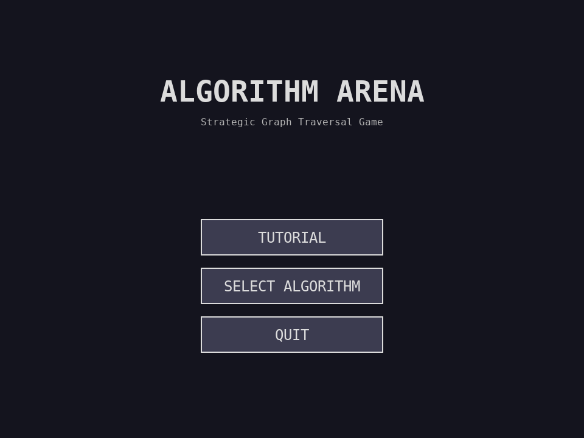
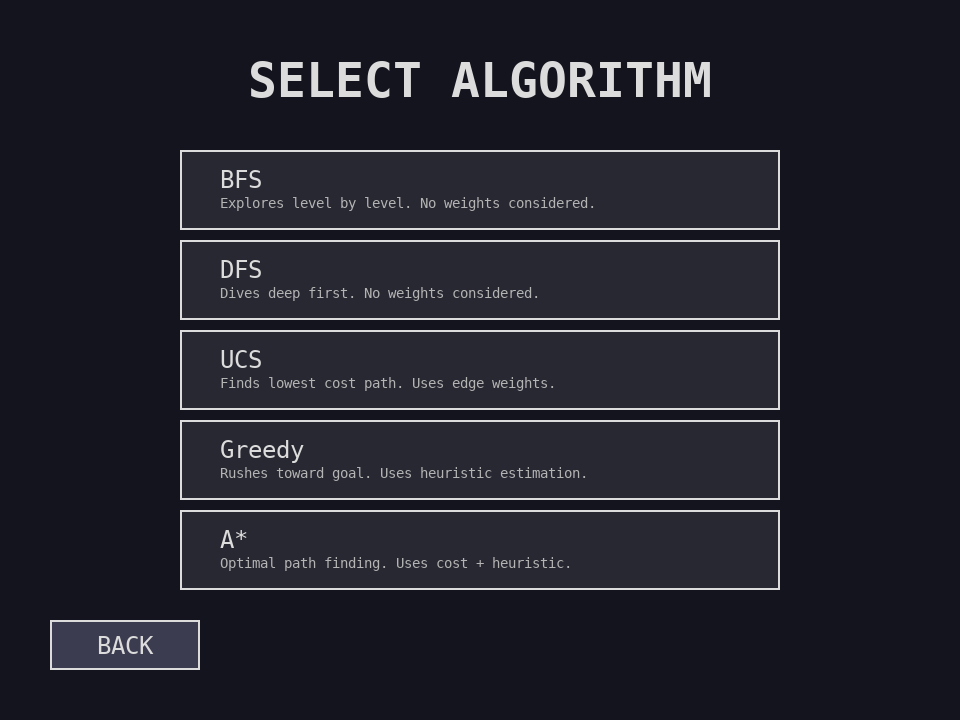
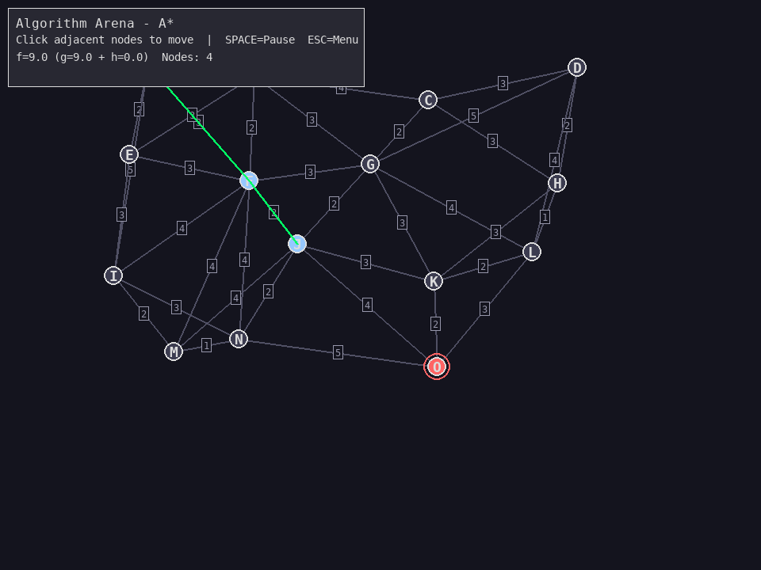

# Algorithm Arena
**Strategic Graph Traversal Game** (formerly Project ARES)

A Python-based graph traversal game where you compete against intelligent AI enemies using different pathfinding algorithms. Choose your algorithm, navigate a weighted graph, and use strategic abilities to survive!

## Team
- **Abdul Rauf** (@abdulraufdev) - Algorithms (Search + Local Planners)
- **Asaad Bin Amir** - Visuals & Sound (HUD, Theme, SFX)
- **Basim Khurram Gul** (@Basim-Gul) - Gameplay, UI, Repo/CI, Logging

## Features

### Algorithm Selection
Choose from 5 pathfinding algorithms before starting the game:
- **BFS** (Breadth-First Search) - Explores level by level
- **DFS** (Depth-First Search) - Dives deep first
- **UCS** (Uniform Cost Search) - Finds lowest cost path
- **Greedy** - Rushes toward goal using heuristics
- **A*** - Optimal pathfinding with cost + heuristic

### Gameplay
- Navigate a graph with labeled nodes (A-Z)
- Enemy AI recalculates path every time you move
- Movement speed varies by edge weight:
  - Low weight (1-2): Fast movement (0.3s)
  - Medium weight (3-5): Normal movement (0.6s)
  - High weight (6-10): Slow movement (1.2s)
- Hover over adjacent nodes to see algorithm-specific information
- Use abilities to manipulate the graph (coming soon)

### Victory Conditions
- Survive for the time limit
- Trap the enemy with no path to you
- Enemy catches you = defeat!

## Quick Start

### Installation
```bash
python -m venv .venv

# Windows
.venv\Scripts\activate

# macOS/Linux
source .venv/bin/activate

pip install -r requirements.txt
```

### Run
```bash
python main.py
```

## Controls
- **Click**: Move to adjacent nodes
- **SPACE**: Pause/Unpause
- **ESC**: Return to main menu

## Project Structure
```
ares/
├── main.py                      # Entry point with menu system
├── config.py                    # Global settings
├── core/                        # Core game systems
│   ├── graph.py                 # Graph with named nodes
│   ├── node.py                  # Node with edges and weights
│   ├── menu.py                  # Main menu and algorithm selection
│   ├── gameplay.py              # Game logic with enemy AI
│   ├── graphics.py              # Graph rendering
│   ├── grid.py                  # Legacy grid system
│   ├── models.py                # Data models
│   └── ui.py                    # Input handling
├── algorithms/                  # Pathfinding algorithms
│   ├── graph_algorithms.py      # Graph-based algorithms
│   ├── bfs.py                   # Breadth-First Search
│   ├── dfs.py                   # Depth-First Search
│   ├── ucs.py                   # Uniform Cost Search
│   ├── greedy.py                # Greedy Best-First
│   ├── astar.py                 # A* Search
│   └── locals_planner.py        # Tactical planning
└── tests/                       # Unit tests
    ├── test_algorithms.py       # Legacy algorithm tests
    └── test_graph.py            # Graph component tests
```

## Algorithms Implemented
- ✅ BFS (Breadth-First Search)
- ✅ DFS (Depth-First Search)
- ✅ UCS (Uniform Cost Search)
- ✅ Greedy Best-First
- ✅ A* Search

## Development

### Running Tests
```bash
pytest tests/
```

All tests should pass:
```
18 passed in 0.04s
```

### Branch Strategy
- `main` - Protected, requires review
- `feature/algorithms` - Abdul's work
- `feature/graphics-ui` - Asaad's work
- `feature/gameplay` - Basim's work

## Screenshots

### Main Menu


### Algorithm Selection


### Gameplay (A* Algorithm)


## License
Educational project for AI coursework.
