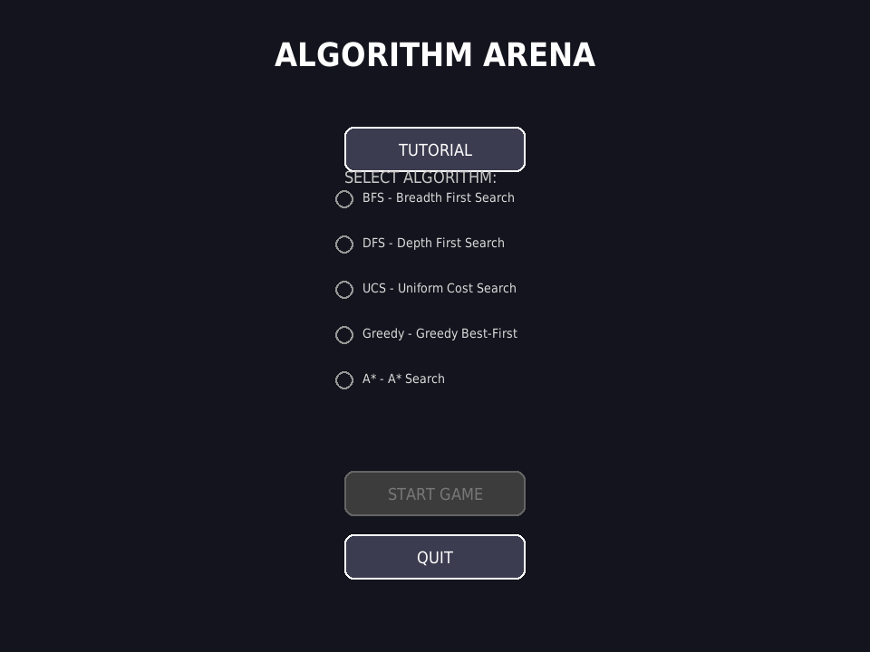
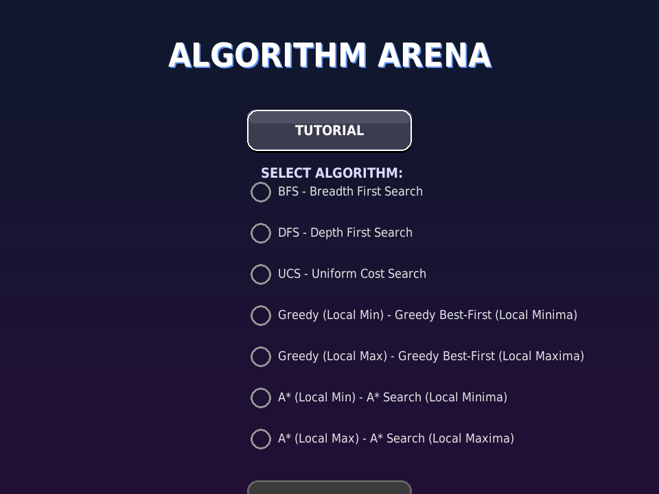
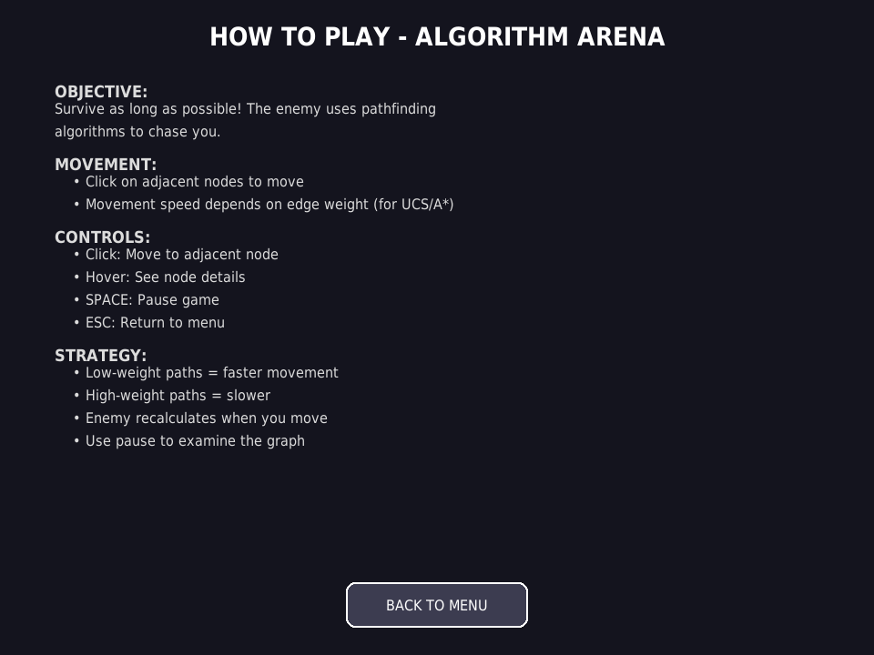
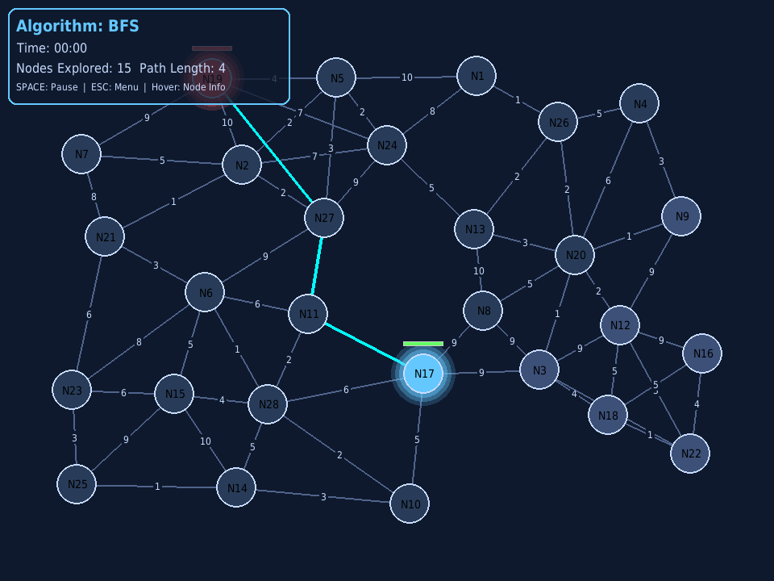
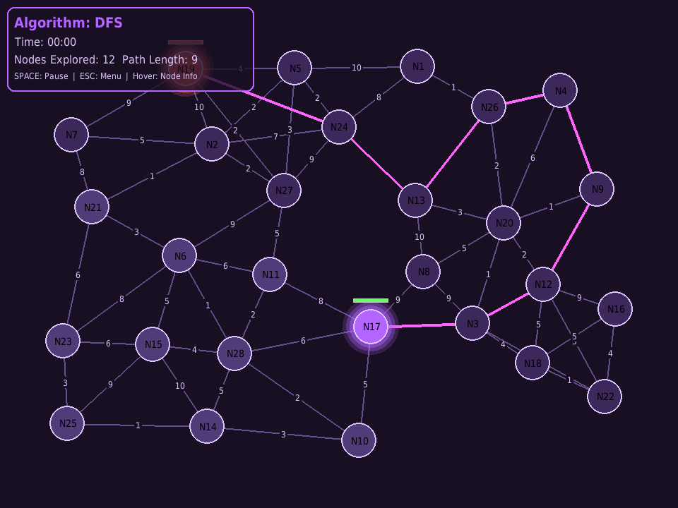
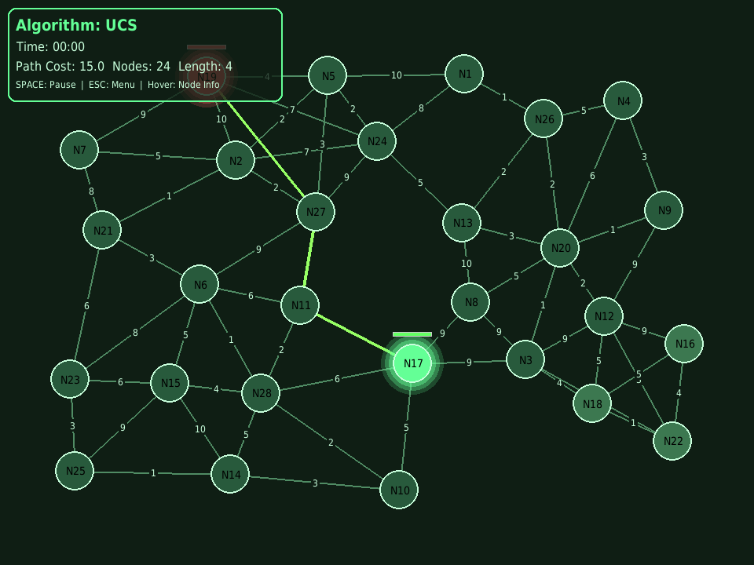
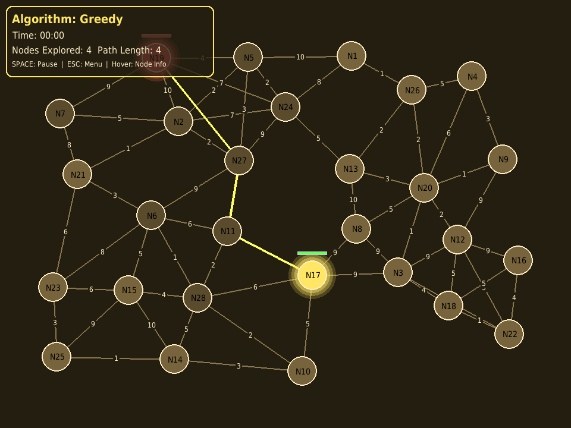
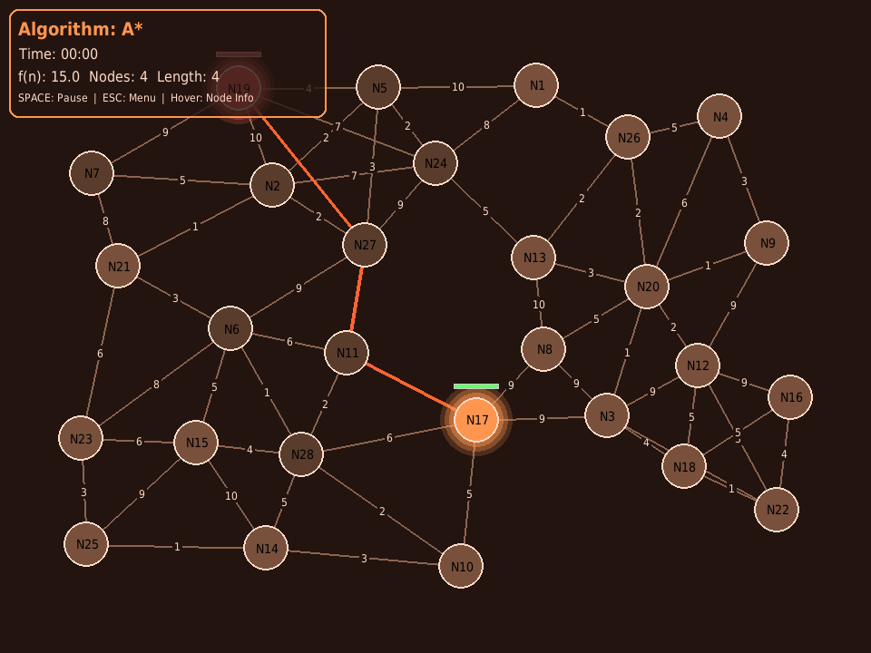
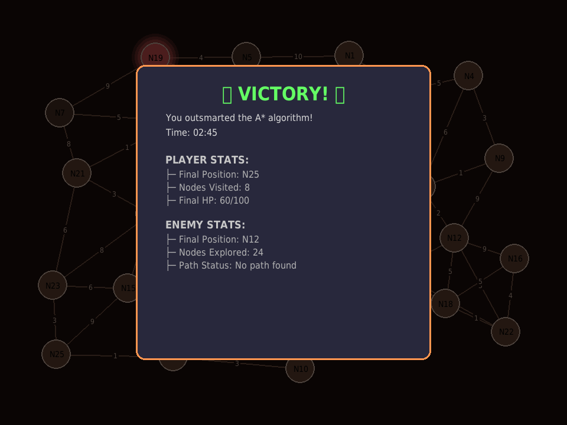
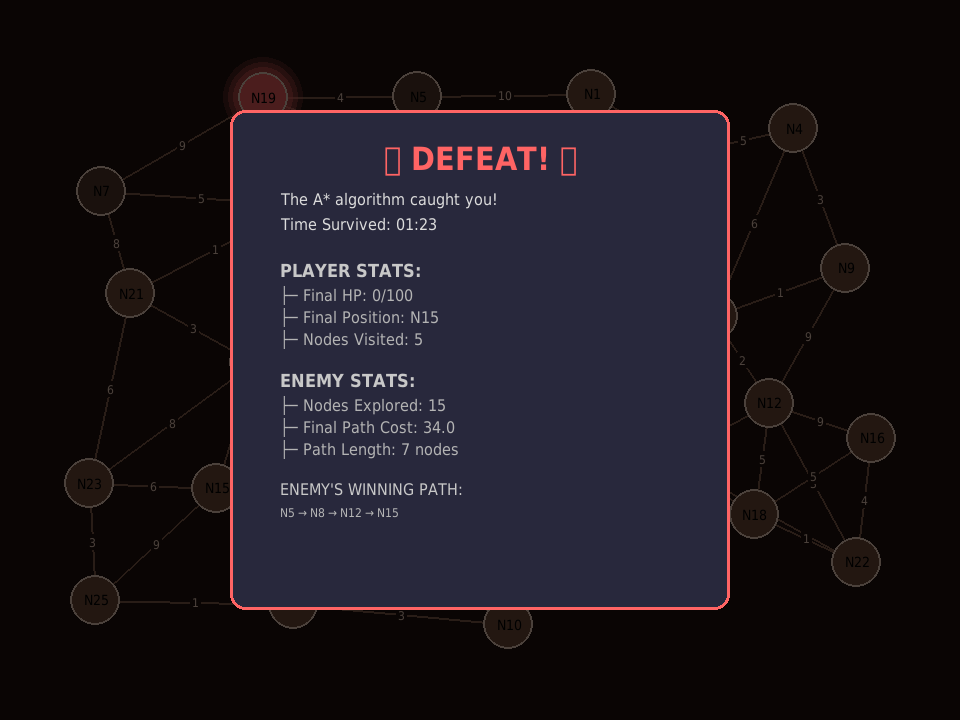

# Algorithm Arena
**Educational Graph-Based Pathfinding Game**

A Python-based interactive game that teaches pathfinding algorithms through engaging gameplay. Players navigate a graph network while an AI enemy uses different algorithms to chase them.

## Features

### 🎮 Interactive Gameplay
- Beautiful interconnected graph with 28 nodes
- Click-to-move navigation system with queue-based pre-move support
- Real-time enemy pathfinding visualization
- Combat system with health tracking
- Algorithm-specific movement speeds
- Smooth animations with cubic easing
- Random spawn positions each game

### 🧠 Educational Algorithms
Choose from 7 pathfinding algorithm variants:
- **BFS** (Breadth-First Search) - Ocean Blue theme
- **DFS** (Depth-First Search) - Purple Mystery theme
- **UCS** (Uniform Cost Search) - Green Mountain theme
- **Greedy (Local Min)** - Lightning Yellow theme
- **Greedy (Local Max)** - Lightning Yellow theme
- **A* (Local Min)** - Desert Orange theme
- **A* (Local Max)** - Desert Orange theme

### 🎨 Beautiful Visuals
- Unique color themes for each algorithm variant
- Glowing effects for player and enemy
- Real-time enemy path highlighting
- Algorithm-specific metrics display
- Hover tooltips with node information (work during pause!)
- Queued move visualization with dashed lines and numbers
- Smooth movement animations with easing

### 📊 Detailed Statistics
- Victory/Defeat screens with algorithm-specific messages
- Nodes explored tracking
- Path cost calculations
- Time tracking
- Visited node tracking with real-time updates

### 🎯 Advanced Features
- **Initial Path Generation**: Ensures valid enemy paths to player at game start
- **Plateau Detection**: Greedy/A* algorithms detect local min/max conditions
- **Visited Node Tracking**: Real-time tooltip updates showing explored nodes
- **Backtracking Rules**: BFS/DFS/UCS allow parent backtracking, prevent leaf revisits
- **Player Tracking**: Greedy/A* follow player only when moving to min/max neighbor
- **Victory Conditions**: Multiple win scenarios based on algorithm type and enemy state

## Team
- **Abdul Rauf** (@abdulraufdev) - Algorithms (Search + Local Planners)
- **Asaad Bin Amir** - Visuals & Sound (HUD, Theme, SFX)
- **Basim Khurram Gul** (@Basim-Gul) - Gameplay, UI, Repo/CI, Logging

## Screenshots

### Main Menu


### Algorithm Selection


### Tutorial


### Gameplay - BFS (Ocean Blue Theme)


### Gameplay - DFS (Purple Mystery Theme)


### Gameplay - UCS (Green Mountain Theme)


### Gameplay - Greedy (Lightning Yellow Theme)


### Gameplay - A* (Desert Orange Theme)


### Victory Screen


### Defeat Screen


## Quick Start

### Installation
```bash
python -m venv .venv

# Windows
.venv\Scripts\activate

# macOS/Linux
source .venv/bin/activate

pip install -r requirements.txt
```

### Run
```bash
python main.py
```

## Controls
- **Mouse Click**: Move to adjacent nodes
- **Mouse Hover**: View node information (works during pause!)
- **SPACE**: Pause/Unpause game
- **ESC**: Return to main menu

## Project Structure
```
algorithm_arena/
├── main.py              # Main game loop and state management
├── config.py            # Game settings and theme configurations
├── core/                # Core game systems
│   ├── node.py          # Node class for graph
│   ├── graph.py         # Graph generation and management
│   ├── gameplay.py      # Game session and entity logic
│   ├── graphics.py      # Rendering system
│   ├── menu.py          # Menu and UI components
│   ├── combat.py        # Combat system
│   └── models.py        # Data models
├── algorithms/          # Pathfinding algorithms
│   ├── graph_algorithms.py  # All 7 algorithm implementations
│   ├── bfs.py           # Grid-based BFS (legacy)
│   ├── dfs.py           # Grid-based DFS (legacy)
│   ├── ucs.py           # Grid-based UCS (legacy)
│   ├── greedy.py        # Grid-based Greedy (legacy)
│   ├── astar.py         # Grid-based A* (legacy)
│   └── common.py        # Shared utilities
├── screenshots/         # Game screenshots
└── tests/               # Unit tests
```

## How It Works

### Graph Generation
- Creates 28 interconnected nodes with organic layout
- Each node connects to 3-6 neighbors
- Static edge weights (assigned once per game)
- Ensures full graph connectivity
- 8-12 leaf nodes (dead-ends) for strategic gameplay

### Game Balance System
- **Initial Path Generation**: For Greedy/A* algorithms, the game creates a valid gradient path from enemy to player at start
- **Local Min**: Descending heuristic values toward player (no immediate plateau)
- **Local Max**: Ascending heuristic values toward player (no immediate plateau)
- **UCS**: Lower path costs along initial path to player
- **Random Spawns**: Player and enemy spawn at least 400px apart each game

### Pathfinding Visualization
- Enemy recalculates path when player moves
- Path is highlighted in real-time with bright colors
- Movement speed varies by algorithm type
- Algorithm-specific metrics displayed in UI
- Visited nodes marked immediately in tooltips

### Combat System
- Player: 100 HP | Enemy: 150 HP
- Contact damage: 10 HP per collision
- Damage cooldown: 1 second
- **Victory Conditions**:
  - Defeat enemy (reduce HP to 0)
  - Enemy reaches plateau (local min/max for Greedy/A*)
  - Enemy completes graph exploration without finding player (BFS/DFS/UCS)
  - Enemy gets stuck in dead-end
- **Defeat**: Player HP reaches 0

### Victory Conditions by Algorithm

#### BFS/DFS/UCS Victory Messages
- **"Enemy explored entire graph but couldn't find player!"** - Enemy traversed all reachable nodes
- **"Enemy got stuck in a dead-end!"** - Enemy has no valid unexplored neighbors
- **"You defeated the [algorithm] enemy!"** - Combat victory

#### Greedy/A* Victory Messages
- **"Enemy reached local minimum but couldn't find player!"** - All neighbors have higher values (Local Min)
- **"Enemy reached local maximum but couldn't find player!"** - All neighbors have lower values (Local Max)
- **"Enemy got stuck in a dead-end!"** - No unvisited neighbors available
- **"You defeated the [algorithm] enemy!"** - Combat victory

## Algorithms Explained

### BFS (Breadth-First Search)
- Explores nodes level by level from enemy position
- **Backtracking**: Can return to parent nodes but cannot revisit leaf nodes
- **Win Condition**: Enemy explores entire graph without finding player
- **Visited Tracking**: Immediately marks nodes as visited in tooltips
- **Enemy Speed**: Slower (800ms between moves)

### DFS (Depth-First Search)
- Explores as deep as possible along each branch before backtracking
- **Backtracking**: Can return to parent nodes but cannot revisit leaf nodes
- **Win Condition**: Enemy explores entire graph without finding player
- **Visited Tracking**: Immediately marks nodes as visited in tooltips
- **Enemy Speed**: Slower (800ms between moves)

### UCS (Uniform Cost Search)
- Considers edge weights to find lowest-cost path
- **Backtracking**: Can return to parent nodes but cannot revisit leaf nodes
- **Win Condition**: Enemy explores entire graph without finding player
- **Visited Tracking**: Immediately marks nodes as visited in tooltips
- **Enemy Speed**: Medium (700ms between moves)

### Greedy (Local Min)
- Always chooses neighbor with minimum heuristic value (closest to player)
- **Plateau Detection**: Stops when stuck at local minimum
- **No Backtracking**: Cannot revisit any previously visited node
- **Player Tracking**: Only follows if player moves to minimum value neighbor
- **Win Condition**: Enemy reaches local minimum or gets stuck
- **Heuristic Display**: Shows distance values in tooltips
- **Enemy Speed**: Faster (600ms between moves)

### Greedy (Local Max)
- Always chooses neighbor with maximum heuristic value (farthest from player)
- **Plateau Detection**: Stops when stuck at local maximum
- **No Backtracking**: Cannot revisit any previously visited node
- **Player Tracking**: Only follows if player moves to maximum value neighbor
- **Win Condition**: Enemy reaches local maximum or gets stuck
- **Heuristic Display**: Shows distance values in tooltips
- **Enemy Speed**: Faster (600ms between moves)

### A* (Local Min)
- Uses f(n) = g(n) + h(n), preferring lower f-values
- **Plateau Detection**: Stops when stuck at local minimum
- **No Backtracking**: Cannot revisit any previously visited node
- **Player Tracking**: Only follows if player moves to minimum f-value neighbor
- **Win Condition**: Enemy reaches local minimum or gets stuck
- **Heuristic Display**: Shows both path cost and heuristic in tooltips
- **Enemy Speed**: Medium (700ms between moves)

### A* (Local Max)
- Uses inverted heuristic to prefer higher values
- **Plateau Detection**: Stops when stuck at local maximum
- **No Backtracking**: Cannot revisit any previously visited node
- **Player Tracking**: Only follows if player moves to maximum f-value neighbor
- **Win Condition**: Enemy reaches local maximum or gets stuck
- **Heuristic Display**: Shows both path cost and heuristic in tooltips
- **Enemy Speed**: Medium (700ms between moves)

## Educational Value

This game teaches:
- **Graph Theory**: Nodes, edges, connectivity, and graph traversal
- **Pathfinding Algorithms**: How different algorithms explore and find paths
- **Algorithm Behavior**: Backtracking vs. no-backtracking strategies
- **Heuristics**: Distance-based estimates for Greedy and A* algorithms
- **Plateau Detection**: Local minima and maxima in optimization
- **Trade-offs**: Speed vs. optimality, exploration vs. exploitation
- **Real-time Algorithm Visualization**: See algorithms in action

## Development

### Running Tests
```bash
pytest tests/
```

## License
Educational project for AI coursework.
